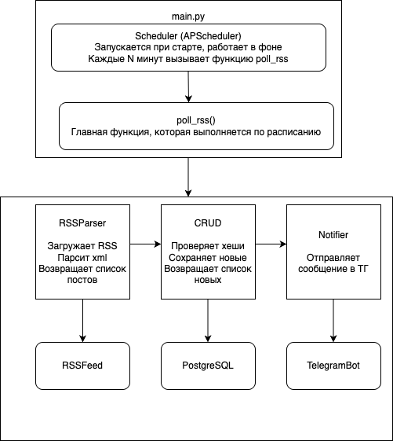

# RSS Telegram Bot

Бот для парсинга RSS-ленты и автоматической отправки новых постов в Telegram.

## 1. Схема взаимодействия компонентов



### Компоненты системы

- Scheduler - планировщик задач (APScheduler), запускает проверку RSS с заданным интервалом
- RSSParser - парсит RSS-ленту (feedparser), извлекает заголовок, ссылку и дату публикации
- crud - CRUD операции с БД, проверяет дубликаты по хэшу, сохраняет новые посты
- Notifier - отправляет сообщения в Telegram (aiogram)
- PostgreSQL - хранит таблицу posts с хэшами отправленных постов

### Поток данных

1. **Scheduler** каждые N минут вызывает функцию `poll_rss()`
2. **RSSParser.fetch()** загружает и парсит RSS → возвращает список постов
3. **PostCrud.save_new_posts()** для каждого поста:
   - вычисляет хэш
   - проверяет хэш в БД
   - если хэша нет, сохраняет пост
4. **Notifier.send_many()** отправляет все новые посты в Telegram
5. Цикл повторяется через заданный интервал


## 2. Модели данных

### Таблица 'posts'

`id` - INTEGER - Первичный ключ
`title` - VARCHAR - Заголовок новости
`link` - VARCHAR - Ссылка на новость (UNIQUE)
`published` - TIMESTAMP - Дата публикации
`content_hash` - VARCHAR - хеш(title + link) (UNIQUE)
`sent_at` - TIMESTAMP - Время отправки (DEFAULT NOW)

## 3. Логика дедупликации
Алгоритм

1. Получаем пост из RSS
2. Вычисляем content_hash = хэш
3. Запрашиваем БД: SELECT id FROM posts WHERE content_hash = ?
4. Если запись найдена, пост уже был отправлен - пропускаем
5. Если запись не найдена - пост новый:
   - INSERT INTO posts (title, link, published, content_hash)
   - Отправляем уведомление в Telegram


## Установка и запуск
```bash
git clone git@github.com:tamoykinden/RSSParser.git
cd rss
```

### Создать виртуальное окружение
```bash
python3 -m venv .venv
source .venv/bin/activate
```

### Установить зависимости
```bash
pip install -r requirements.txt
```

### Создать .env из примера
```bash
cp .env.example .env
# Отредактировать .env (добавить токен, chat_id, настройки БД)
```

### Создать базу данных PostgreSQL
```bash
sudo -u postgres psql
CREATE DATABASE rss_bot;
CREATE USER your_user WITH PASSWORD 'your_password';
GRANT ALL PRIVILEGES ON DATABASE rss_bot TO your_user;
\q
```

### Запустить бота
```bash
python3 main.py
```